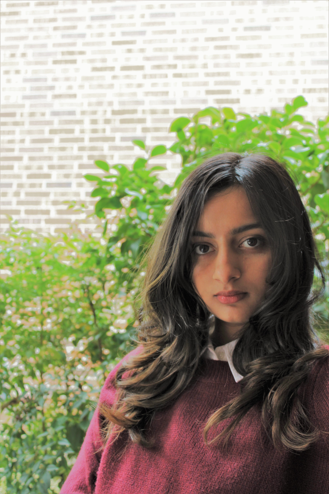

## About Me

Hi! I'm currently a Master's student in Computational Linguistics at the University of Washington. My Master's thesis is on Probing Multilingual LLMs for Typological Signals, supervised by Prof. Shane Steinert-Threlkeld. In the past, I've interned at Hewlett Packard Data Science Institute through the [Pharis Fellowship](https://uh.edu/honors/Programs-Minors/co-curricular-programs/data-and-community-health/data-society/summer-research.php) where I worked on modeling cancer patient pathways. I did my undergrad at the University of Houston majoring in Computer Science and Math with a concentration in Data Science. I worked with Professor [Thamar Solorio](http://solorio.uh.edu/) at the [RiTUAL](https://ritual.uh.edu/) (Research in Text Understanding and Analysis of Language) lab. I've also had the good fortune of spending a summer as a recipient of the SURF scholarship. 

### Publications 

#### Normalization and Back-transliteration for Code-Switched Text, CALCS (NAACL 2021), Dwija Parikh and Thamar Solorio  
* Developed a preprocessing module specifically designed for code-switched data, utilizing a hybrid approach that combined rulebased phonemic transcription methods with machine learning techniques, including a seq2seq model employing LSTM networks, resulting in an accuracy rate of 78.6%
* Engineered a novel grapheme-to-phoneme (G2P) conversion technique specifically tailored for romanized Hindi data, enhancing the processing and analysis of code-switched text in social media contexts
* Contributed to the field by releasing a valuable dataset of script-corrected Hindi-English code-switched sentences, meticulously labeled for named entity recognition and part-of-speech tagging tasks, fostering further advancements in code-switching research within NLP  

### Contact Me

<dwija@uw.edu>

